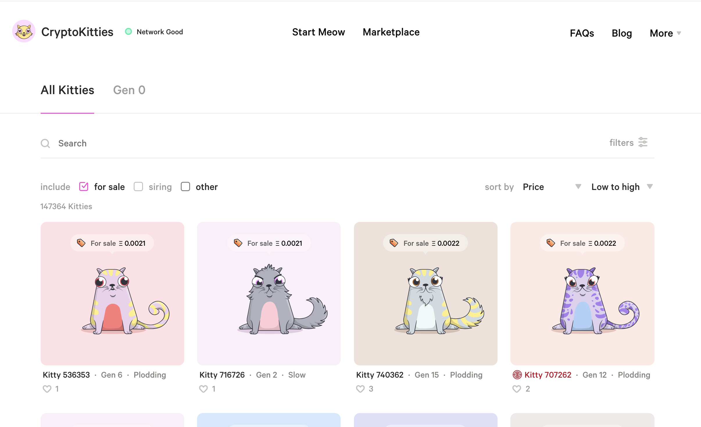
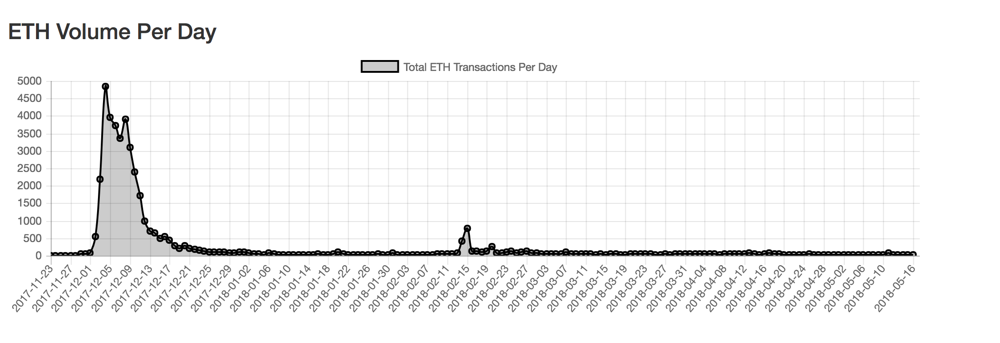
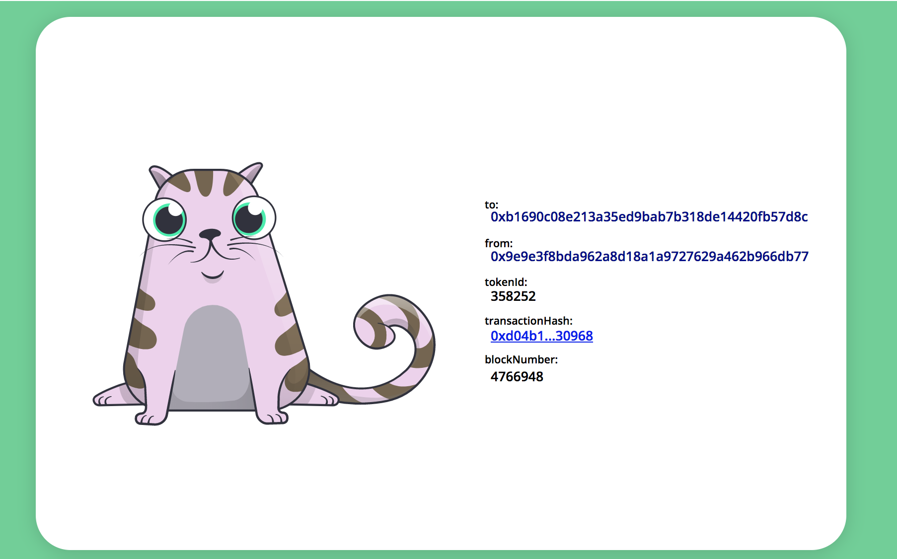

# Ethereum

---

## Cryptokitties, what are they?

Like crypto-tamagotchi. Check out the [marketplace](https://www.cryptokitties.co/marketplace)

---

## What are they worth?

Turns out over 12 million dollars!

---

## Ethereum Market Cap

- Second highest cryptocurrency market cap
- Doesn't inlcude the sum of the value of tokens

---

## Kitty Monitor

- Monitor the sales in real time with the [kitty-monitor](https://github.com/f-o-a-m/purescript-kitty-monitor)
- Backed by purescript-web3

