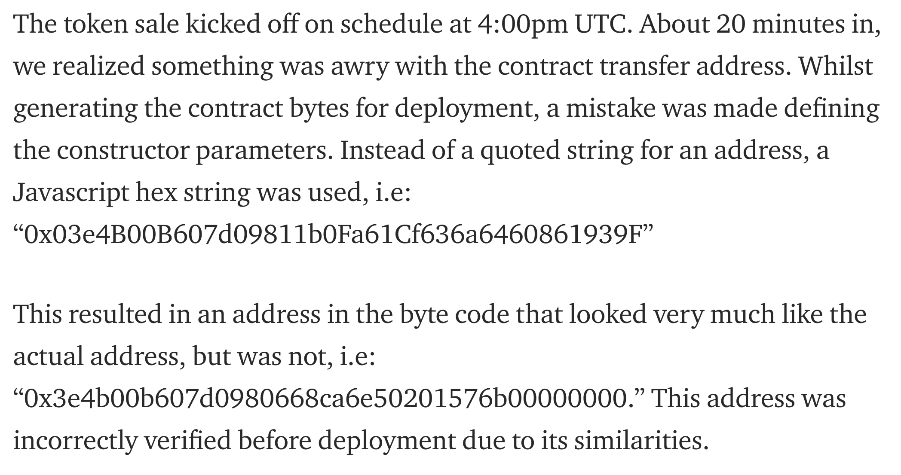
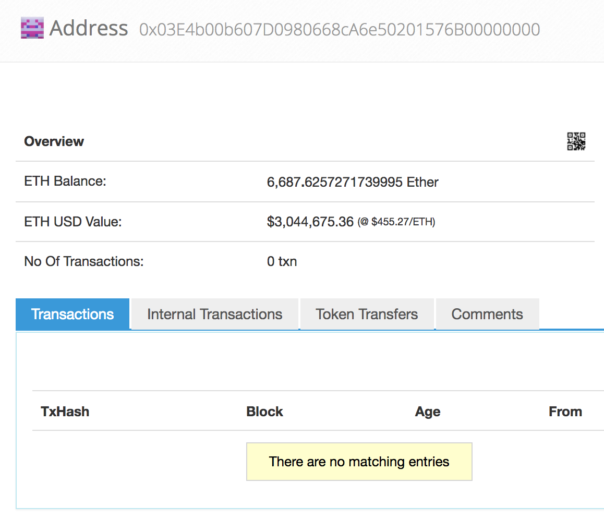

# ethereum

## What is it

- Second most popupular blockchain and cryptocurrency
- Turing-complete[^0] statemachine (EVM)
- Allows consensus around execution of smart contracts

[^0]: What about gas?

---


---


---


---

## Solidity

- Javascript like syntax
- Special blockchain, crypto and signature-recovery primitives
- Types for EVM primitives such as `uint48`
- Interface through `ABI`

---

```javascript
contract GreedyStorage is owned {
  uint public m; // automatically generate getM()
  event Overidden(address overrider)
  function increase (uint n) onlyOwner returns (uint) {
     m = m + n;
     return m;
  }
  function override (uint n) payable {
    require(msg.value > 100000);  // this is the price
    m = n;
    Overidden(msg.sender);
  }
}
```

[edit on remix](https://ethereum.github.io/browser-solidity/#version=soljson-v0.4.19+commit.c4cbbb05.js&optimize=undefined&gist=a90b20b6df66c98f7af2f912952d2b7d)

---

The **selector** is how we speficy the function to execute

```haskell
selector :: FunctionSignature -> ByteString
selector = take 8 $ sha3

> selector "increase(uint256)"
> "30f3f0db"
```

so for `GreedyStorage` we get

```json
{
    "increase(uint256)" : "30f3f0db",
    "m()"               : "5a2ee019",
    "override(uint256)" : "94d9e61c"
}
```

---

## Typesafety (on-chain)
- Work underway for strongly typed languages targeting EVM
- Typesafe EVM language wouldn't necessarily have prevented infamous bugs. We'd need session types or similar.
- Fundamental problem is call-out from turingcomplete executable to turing complete executable. Type level information not preserved on EVM.

---

## Typesafety (off-chain)

### Prevent catastrophes

- Encoding errors
- Improper value transfer
- Function/argument mismatch

---

### Conveniences

- Migrations / CD-CI
- Type safety

---



---



---

Subtle changes leading to broken application code

```javascript
contract A {
  uint n;
  function A (uint _arg) {
    n = _arg;
  }
}
```

```javascript
contract A {
  int n;
  function A (int _arg) {
    n = _arg;
  }
}
```
