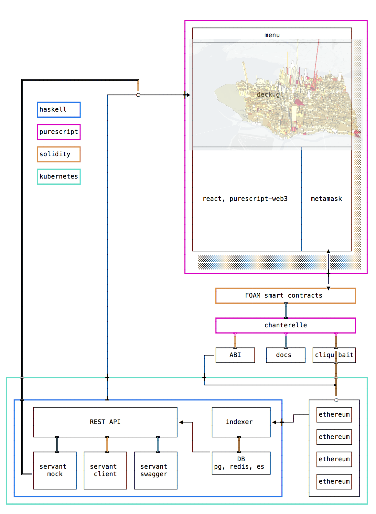

---

# Architecting an Ethereum App

## What does the whole picture look like?

---

## Pieces of FOAM
- An Ethereum Client: Geth / Parity / Cliquebait
- Chanterelle: A smart contract deployment, testing, and migration framework written in purescript.
- FOAM Indexer: A stream processing service indexing ethereum logs in Postgres, Redis, and  Elasticsearch.
- FOAM API: A REST api with websocket services serving content captured from indexed contracts.

---

## Functional Web3 Libraries
- purescript-web3: A web3 client library for purescript. Capable of generating client libraries for smart contracts from Solidity ABIs. Integrates with services like Metamask or uPort for in-browser transaction signing. Plays very nicely with Chanterelle.
- hs-web3: A haskell web3 client library. Also capable of creating client libraries from ABIs using Template Haskell.