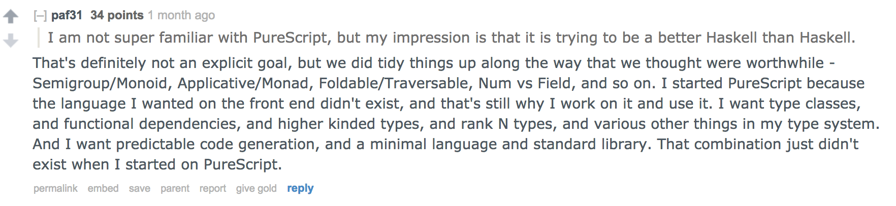

---

# purescript

## What is it



See Phil's article [Why you should use purescript?](http://blog.functorial.com/posts/2017-08-09-Why-You-Should-Use-PureScript.html) for some of the highlights

---

## A haskell programmer's solution to the javascript problem

- Algebraic datatypes (sums of products), row types (records)
- Type classes (functor, monad, foldable, etc) and constraints
- Pure, extensible effects (may go away)
- Prism/Lens/Traversable

---

## A haskell programmer's solution to the javascript problem

```haskell
data MyProd = MyProd Int String

data MySum = MyInt Int 
           | MyString String

data MyRec1 = MyRec1 {name :: String, size :: Int}
data MyRec2 = MyRec2 {age :: Int, nice :: Boolean}

data MyRecProd = MyRecProd MyRec1 MyRec2

data MyRecSum  = FirstRec MyRec1 
               | SndRec MyRec2
```

---

## A haskell programmer's solution to the javascript problem

- Compiles to clean (human readable) JS code
- Easy FFI, use existing js libraries whenever makes sense
- Doesn't yet optimize

---

## Comparison with `elm`

- Functional, row types
- Arguably easier to get started 
- Weaker type system (effects, polymorphism, typeclasses)

## Comparison with `ghcjs`

- Make use of existing haskell ecosystem
- Laziness, garbage collection, shared code
- Heavy (needs runtime)

---
